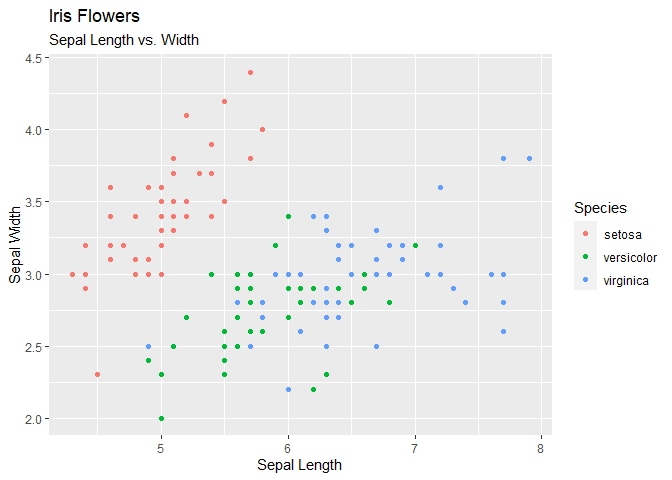
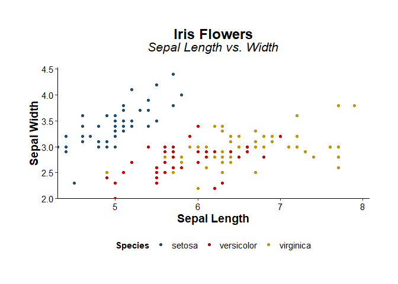
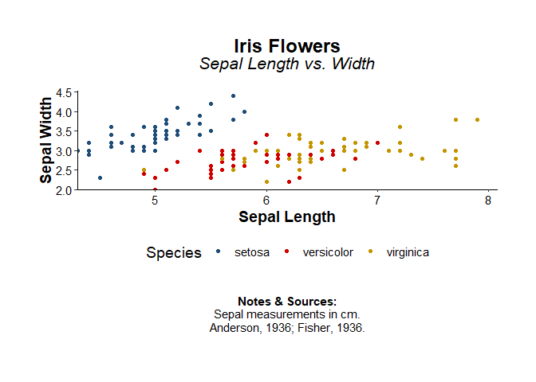

<!-- README.md is generated from README.Rmd. Please edit that file -->

# themecleanR

<!-- badges: start -->
<!-- badges: end -->

The goal of themecleanR is to create clean ggplots for reports

## Installation

You can install the development version of themecleanR from
[GitHub](https://github.com/) with:

``` r
# install.packages("devtools")
devtools::install_github("DannyMRoss/themecleanR")
```

## Example

``` r
attach(iris)
library(ggplot2)
library(themecleanR)

# make plot
plot <- ggplot(iris, aes(x=Sepal.Length, y=Sepal.Width, color=Species)) +
  labs(title="Iris Flowers", subtitle="Sepal Length vs. Width",
       x="Sepal Length", y="Sepal Width") +
  geom_point()

# standard ggplot
plot
```



``` r

# cleaned ggplot
plot + theme_clean()
```



``` r

# add notes and sources
plot + 
  labs(caption=notes_format(c("Sepal measurements in cm.",
                              "Anderson, 1936; Fisher, 1936."))) + 
  theme_clean()
```


