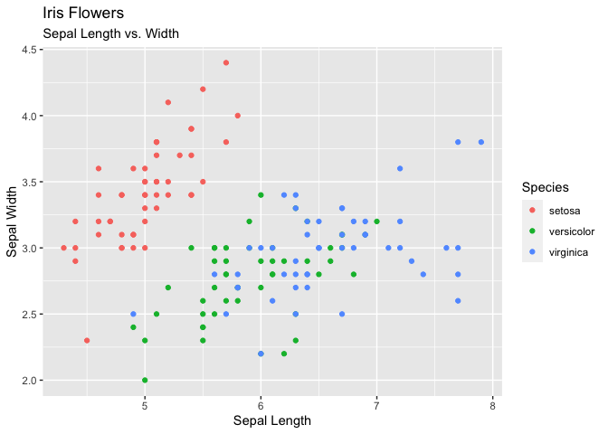
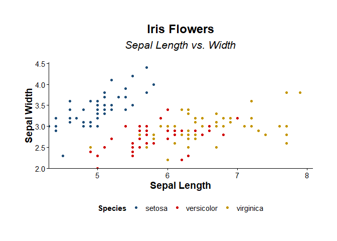
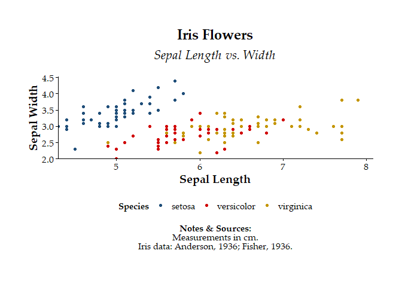
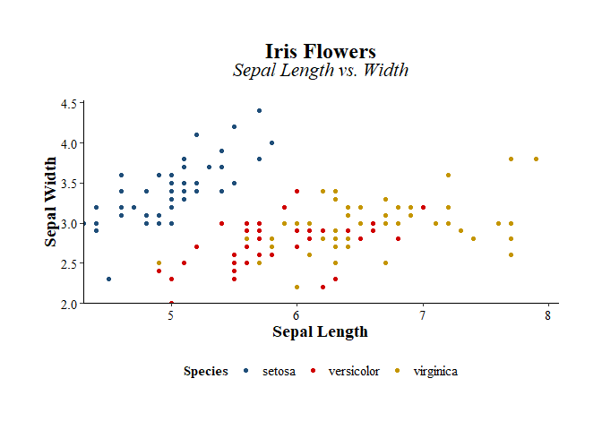
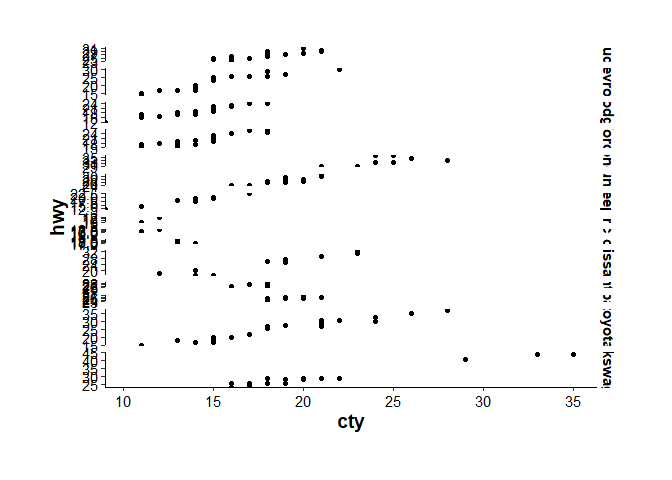

<!-- README.md is generated from README.Rmd. Please edit that file -->

# themecleanR

<!-- badges: start -->
<!-- badges: end -->

The goal of themecleanR is to create clean ggplots for reports

## Installation

You can install the development version of themecleanR from
[GitHub](https://github.com/) with:

``` r
# install.packages("devtools")
devtools::install_github("DannyMRoss/themecleanR")
```

## Examples

``` r
attach(iris)
library(ggplot2)
library(extrafont)
#> Registering fonts with R
library(themecleanR)

# make plot
plot <- ggplot(iris, aes(x=Sepal.Length, y=Sepal.Width, color=Species)) +
  labs(title="Iris Flowers", subtitle="Sepal Length vs. Width",
       x="Sepal Length", y="Sepal Width") +
  geom_point()

# standard ggplot
plot
```



``` r

# cleaned ggplot
theme_clean(plot)
```



``` r

# add notes and sources
theme_clean(plot,
            font = "Palatino Linotype",
            caption = c("Sepal measurements in cm.","Iris data: Anderson, 1936; Fisher, 1936."))
```



``` r
attach(mpg)

plot2 <- ggplot(mpg, aes(cty, hwy)) + 
  geom_point() + 
  facet_grid(manufacturer ~ ., scales = "free", space = "free")

# facet grid
plot2
```



``` r

#
theme_clean(plot2)
```


