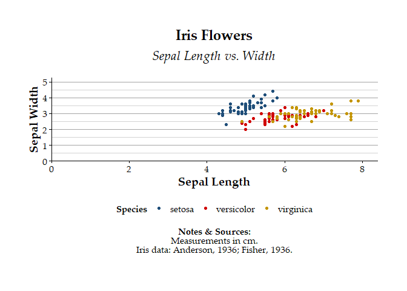

<!-- README.md is generated from README.Rmd. Please edit that file -->

# themecleanR

<!-- badges: start -->
<!-- badges: end -->

The goal of themecleanR is to create clean ggplots for reports

## Installation

You can install the development version of themecleanR from
[GitHub](https://github.com/) with:

``` r
# install.packages("devtools")
devtools::install_github("DannyMRoss/themecleanR")
```

## Examples

``` r
attach(iris)
library(ggplot2)
library(extrafont)
#> Registering fonts with R
library(themecleanR)

# make plot
plot <- ggplot(iris, aes(x=Sepal.Length, y=Sepal.Width, color=Species)) +
  labs(title="Iris Flowers", subtitle="Sepal Length vs. Width",
       x="Sepal Length", y="Sepal Width") +
  geom_point()

# standard ggplot
plot
```


``` r

# cleaned ggplot
theme_clean(plot)
```


``` r

# add notes and sources
theme_clean(plot,
            font = "Palatino Linotype",
            caption = c("Sepal measurements in cm.","Iris data: Anderson, 1936; Fisher, 1936."))
```


``` r

# save plot
theme_clean(plot,
            font = "Palatino Linotype",
            caption = c("Sepal measurements in cm.","Iris data: Anderson, 1936; Fisher, 1936."),
            save_filename = "man/figures/iris.pdf", save_paper_size = "letter", save_orientation = "landscape")
```


