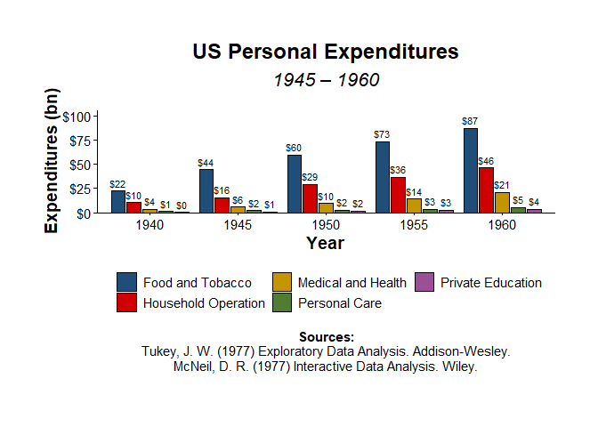

<!-- README.md is generated from README.Rmd. Please edit that file -->

# themecleanR

<!-- badges: start -->
<!-- badges: end -->

The goal of themecleanR is to create clean(R) ggplots and tables with a
more concise syntax.

## Installation

You can install the development version of themecleanR from
[GitHub](https://github.com/) with:

``` r
# install.packages("devtools")
devtools::install_github("DannyMRoss/themecleanR")
```

## Examples

    #> Registering fonts with R
    #> Warning: replacing previous import 'data.table::first' by 'dplyr::first' when
    #> loading 'themecleanR'
    #> Warning: replacing previous import 'data.table::last' by 'dplyr::last' when
    #> loading 'themecleanR'
    #> Warning: replacing previous import 'data.table::between' by 'dplyr::between'
    #> when loading 'themecleanR'

``` r
# make plot
plot <- ggplot(iris, aes(x=Sepal.Length, y=Sepal.Width, color=Species)) +
  labs(title="Iris Flowers", subtitle="Sepal Length vs. Width",
       x="Sepal Length", y="Sepal Width") +
  geom_point()

# standard ggplot
plot
```


``` r

# cleaned ggplot
theme_clean(plot)
```


``` r

# add notes and sources
sources <- c("Measurements in cm.","Iris data: Anderson, 1936; Fisher, 1936.")

theme_clean(plot,
            font = "Palatino Linotype",
            caption = sources)
```


``` r

# includes parameters for formatting shortcuts
theme_clean(plot,
            font = "Palatino Linotype",
            caption = sources,
            xlims=c(0,8), ylims=c(0,5), ylines = TRUE)
```


``` r

# save plot
theme_clean(plot,
            font = "Palatino Linotype",
            caption = sources,
            save_filename = "man/figures/iris.pdf", save_paper_size = "letter", save_orientation = "landscape")
```


``` r

# dark theme
theme_clean(plot,
            dark=TRUE,
            font = "Palatino Linotype",
            caption = sources,
            save_filename = "man/figures/iris_dark.pdf", save_paper_size = "letter", save_orientation = "landscape")
```


``` r

# apply same formatting to multiple plots and save in a single pdf
plot2 <- ggplot(iris, aes(x=Petal.Length, y=Petal.Width, color=Species)) +
  labs(title="Iris Flowers", subtitle="Petal Length vs. Width",
       x="Petal Length", y="Petal Width") +
  geom_point()

theme_clean(list(plot, plot2),
            font = "Palatino Linotype",
            caption = sources,
            save_filename = "man/figures/iris2.pdf")
#> [[1]]
```


    #> 
    #> [[2]]


``` r
# bar chart example
plot3 <- ggplot(PersonalExpenditure, aes(x=year, y=expenditure, fill=category)) +
  geom_col(position=position_dodge(width = .9), color="black", width = .8) +
  geom_text(aes(label = dollar(expenditure, 1)), 
            position = position_dodge(width = .9), vjust=-.5, size=3) +
  labs(title="US Personal Expenditures", subtitle="1945 \u2013 1960",
       y="Expenditures (bn)", x="Year", fill=NULL)

sources <- c("Tukey, J. W. (1977) Exploratory Data Analysis. Addison-Wesley.",
             "McNeil, D. R. (1977) Interactive Data Analysis. Wiley.")

theme_clean(plot3, 
            caption = sources, caption_title = "Sources:", 
            ylabels = dollar, ybreaks = seq(0,100,25),
            legend_rows = 2)
```


